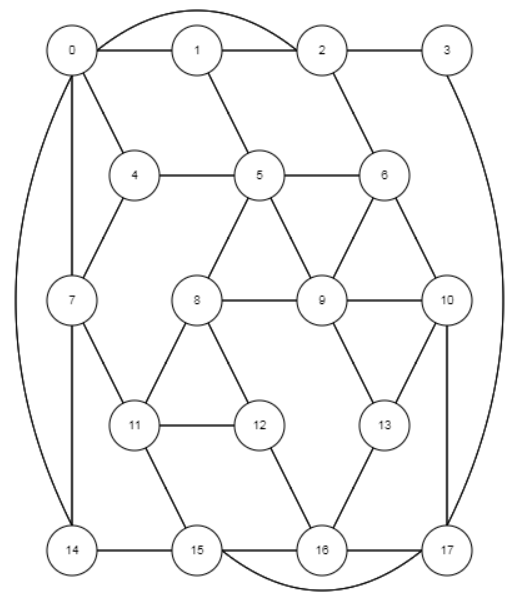
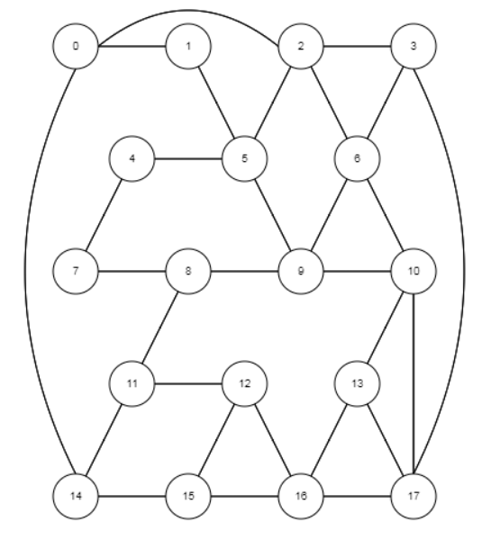
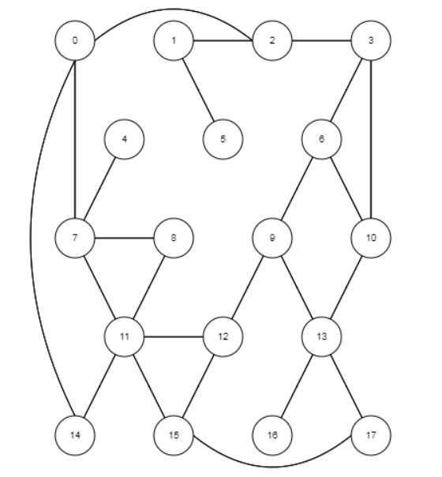

## Graph 1



```bash
0 1
0 2
0 4
0 7
0 14
1 2
1 5
2 3
2 6
3 17
4 5
4 7
5 6
5 8
5 9
6 9
6 10
7 11
7 14
8 9
8 11
8 12
9 10
9 13
10 13
10 17
11 12
11 15
12 16
13 16
14 15
15 15
15 17
16 17
```

## Graph 2



```bash
0 1
0 2
0 14
1 5
2 3
2 5
2 6
3 6
3 17
4 5
4 7
5 9
6 9
6 10
7 8
8 9
8 11
9 10
10 13
10 17
11 12
11 14
12 15
12 16
13 16
13 17
14 15
15 16
16 17
```

## Graph 3



```bash
0 2
0 7
0 14
1 2
1 5
2 3
3 6
4 7
6 9
6 10
7 8
7 11
8 11
9 12
9 13
10 13
11 12
11 14
11 15
12 15
13 16
13 17
15 17
```