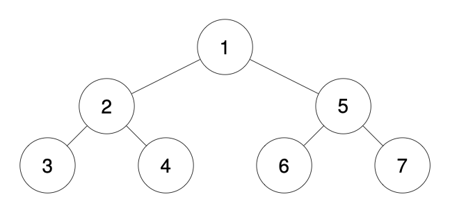
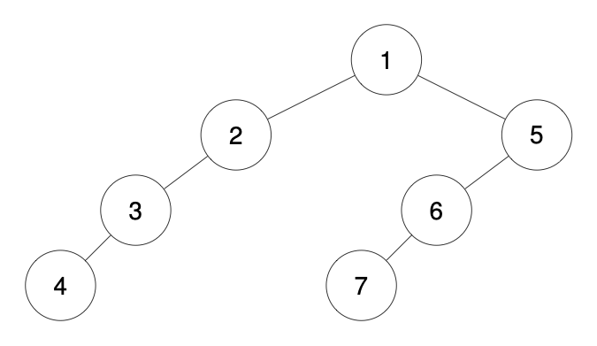
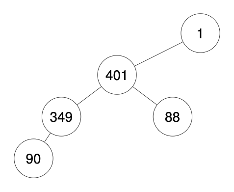

<h3>Recover a Tree From Preorder Traversal</h3>

We run a preorder depth-first search (DFS) on the <code>root</code> of a binary tree.

At each node in this traversal, we output <code>D</code> dashes (where <code>D</code> is the depth of this node), then we output the value of this node.  If the depth of a node is <code>D</code>, the depth of its immediate child is <code>D + 1</code>.  The depth of the <code>root</code> node is <code>0</code>.

If a node has only one child, that child is guaranteed to be <strong>the left child</strong>.

Given the output <code>traversal</code> of this traversal, recover the tree and return <em>its</em> <code>root</code>.

 

<strong>Example 1:</strong>

<pre><strong>Input:</strong> traversal = "1-2--3--4-5--6--7"
<strong>Output:</strong> [1,2,5,3,4,6,7]
</pre>

<strong>Example 2:</strong>

<pre><strong>Input:</strong> traversal = "1-2--3---4-5--6---7"
<strong>Output:</strong> [1,2,5,3,null,6,null,4,null,7]
</pre>

<strong>Example 3:</strong>

<pre><strong>Input:</strong> traversal = "1-401--349---90--88"
<strong>Output:</strong> [1,401,null,349,88,90]
</pre>

 

<strong>Constraints:</strong>

<ul>
<li>The number of nodes in the original tree is in the range <code>[1, 1000]</code>.</li>
<li><code>1 &lt;= Node.val &lt;= 109</code></li>
</ul>

