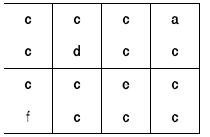

<h3>Detect Cycles in 2D Grid</h3>

Given a 2D array of characters <code>grid</code> of size <code>m x n</code>, you need to find if there exists any cycle consisting of the <strong>same value</strong> in <code>grid</code>.

A cycle is a path of <strong>length 4 or more</strong> in the grid that starts and ends at the same cell. From a given cell, you can move to one of the cells adjacent to it - in one of the four directions (up, down, left, or right), if it has the <strong>same value</strong> of the current cell.

Also, you cannot move to the cell that you visited in your last move. For example, the cycle <code>(1, 1) -&gt; (1, 2) -&gt; (1, 1)</code> is invalid because from <code>(1, 2)</code> we visited <code>(1, 1)</code> which was the last visited cell.

Return <code>true</code> if any cycle of the same value exists in <code>grid</code>, otherwise, return <code>false</code>.

 

<strong>Example 1:</strong>

<strong></strong>

<pre><strong>Input:</strong> grid = [["a","a","a","a"],["a","b","b","a"],["a","b","b","a"],["a","a","a","a"]]
<strong>Output:</strong> true
<strong>Explanation: </strong>There are two valid cycles shown in different colors in the image below:

</pre>

<strong>Example 2:</strong>

<strong></strong>

<pre><strong>Input:</strong> grid = [["c","c","c","a"],["c","d","c","c"],["c","c","e","c"],["f","c","c","c"]]
<strong>Output:</strong> true
<strong>Explanation: </strong>There is only one valid cycle highlighted in the image below:

</pre>

<strong>Example 3:</strong>

<strong></strong>

<pre><strong>Input:</strong> grid = [["a","b","b"],["b","z","b"],["b","b","a"]]
<strong>Output:</strong> false
</pre>

 

<strong>Constraints:</strong>

<ul>
<li><code>m == grid.length</code></li>
<li><code>n == grid[i].length</code></li>
<li><code>1 &lt;= m, n &lt;= 500</code></li>
<li><code>grid</code> consists only of lowercase English letters.</li>
</ul>

