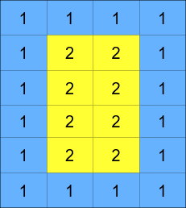
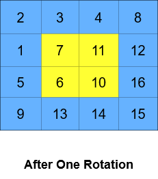

<h3>Cyclically Rotating a Grid</h3>

You are given an <code>m x n</code> integer matrix <code>grid</code>​​​, where <code>m</code> and <code>n</code> are both <strong>even</strong> integers, and an integer <code>k</code>.

The matrix is composed of several layers, which is shown in the below image, where each color is its own layer:

A cyclic rotation of the matrix is done by cyclically rotating <strong>each layer</strong> in the matrix. To cyclically rotate a layer once, each element in the layer will take the place of the adjacent element in the <strong>counter-clockwise</strong> direction. An example rotation is shown below:

Return <em>the matrix after applying </em><code>k</code> <em>cyclic rotations to it</em>.

 

<strong>Example 1:</strong>

<pre><strong>Input:</strong> grid = [[40,10],[30,20]], k = 1
<strong>Output:</strong> [[10,20],[40,30]]
<strong>Explanation:</strong> The figures above represent the grid at every state.
</pre>

<strong>Example 2:</strong>

<strong></strong> <strong></strong> <strong></strong>
<pre><strong>Input:</strong> grid = [[1,2,3,4],[5,6,7,8],[9,10,11,12],[13,14,15,16]], k = 2
<strong>Output:</strong> [[3,4,8,12],[2,11,10,16],[1,7,6,15],[5,9,13,14]]
<strong>Explanation:</strong> The figures above represent the grid at every state.
</pre>

 

<strong>Constraints:</strong>

<ul>
<li><code>m == grid.length</code></li>
<li><code>n == grid[i].length</code></li>
<li><code>2 &lt;= m, n &lt;= 50</code></li>
<li>Both <code>m</code> and <code>n</code> are <strong>even</strong> integers.</li>
<li><code>1 &lt;= grid[i][j] &lt;= 5000</code></li>
<li><code>1 &lt;= k &lt;= 109</code></li>
</ul>

