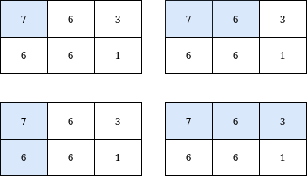

<h3>Count Submatrices with Top-Left Element and Sum Less Than k</h3>

You are given a <strong>0-indexed</strong> integer matrix <code>grid</code> and an integer <code>k</code>.

Return <em>the <strong>number</strong> of <button aria-controls="radix-:r1s:" aria-expanded="false" aria-haspopup="dialog" class="" data-state="closed" type="button">submatrices</button> that contain the top-left element of the</em> <code>grid</code>, <em>and have a sum less than or equal to </em><code>k</code>.

 

<strong>Example 1:</strong>

<pre><strong>Input:</strong> grid = [[7,6,3],[6,6,1]], k = 18
<strong>Output:</strong> 4
<strong>Explanation:</strong> There are only 4 submatrices, shown in the image above, that contain the top-left element of grid, and have a sum less than or equal to 18.</pre>

<strong>Example 2:</strong>

<pre><strong>Input:</strong> grid = [[7,2,9],[1,5,0],[2,6,6]], k = 20
<strong>Output:</strong> 6
<strong>Explanation:</strong> There are only 6 submatrices, shown in the image above, that contain the top-left element of grid, and have a sum less than or equal to 20.
</pre>

 

<strong>Constraints:</strong>

<ul>
<li><code>m == grid.length </code></li>
<li><code>n == grid[i].length</code></li>
<li><code>1 &lt;= n, m &lt;= 1000 </code></li>
<li><code>0 &lt;= grid[i][j] &lt;= 1000</code></li>
<li><code>1 &lt;= k &lt;= 109</code></li>
</ul>

