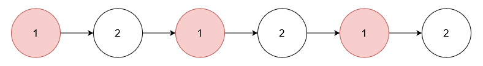

<h3>Delete Nodes From Linked List Present in Array</h3>

You are given an array of integers <code>nums</code> and the <code>head</code> of a linked list. Return the <code>head</code> of the modified linked list after <strong>removing</strong> all nodes from the linked list that have a value that exists in <code>nums</code>.

 

<strong>Example 1:</strong>

<strong>Input:</strong> nums = [1,2,3], head = [1,2,3,4,5]

<strong>Output:</strong> [4,5]

<strong>Explanation:</strong>

<strong></strong>

Remove the nodes with values 1, 2, and 3.

<strong>Example 2:</strong>

<strong>Input:</strong> nums = [1], head = [1,2,1,2,1,2]

<strong>Output:</strong> [2,2,2]

<strong>Explanation:</strong>

Remove the nodes with value 1.

<strong>Example 3:</strong>

<strong>Input:</strong> nums = [5], head = [1,2,3,4]

<strong>Output:</strong> [1,2,3,4]

<strong>Explanation:</strong>

<strong></strong>

No node has value 5.

 

<strong>Constraints:</strong>

<ul>
<li><code>1 &lt;= nums.length &lt;= 105</code></li>
<li><code>1 &lt;= nums[i] &lt;= 105</code></li>
<li>All elements in <code>nums</code> are unique.</li>
<li>The number of nodes in the given list is in the range <code>[1, 105]</code>.</li>
<li><code>1 &lt;= Node.val &lt;= 105</code></li>
<li>The input is generated such that there is at least one node in the linked list that has a value not present in <code>nums</code>.</li>
</ul>

