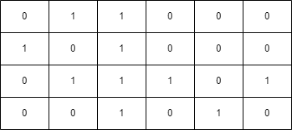
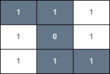

<h3>Find a Safe Walk Through a Grid</h3>

You are given an <code>m x n</code> binary matrix <code>grid</code> and an integer <code>health</code>.

You start on the upper-left corner <code>(0, 0)</code> and would like to get to the lower-right corner <code>(m - 1, n - 1)</code>.

You can move up, down, left, or right from one cell to another adjacent cell as long as your health <em>remains</em> <strong>positive</strong>.

Cells <code>(i, j)</code> with <code>grid[i][j] = 1</code> are considered <strong>unsafe</strong> and reduce your health by 1.

Return <code>true</code> if you can reach the final cell with a health value of 1 or more, and <code>false</code> otherwise.

 

<strong>Example 1:</strong>

<strong>Input:</strong> grid = [[0,1,0,0,0],[0,1,0,1,0],[0,0,0,1,0]], health = 1

<strong>Output:</strong> true

<strong>Explanation:</strong>

The final cell can be reached safely by walking along the gray cells below.

<strong>Example 2:</strong>

<strong>Input:</strong> grid = [[0,1,1,0,0,0],[1,0,1,0,0,0],[0,1,1,1,0,1],[0,0,1,0,1,0]], health = 3

<strong>Output:</strong> false

<strong>Explanation:</strong>

A minimum of 4 health points is needed to reach the final cell safely.

<strong>Example 3:</strong>

<strong>Input:</strong> grid = [[1,1,1],[1,0,1],[1,1,1]], health = 5

<strong>Output:</strong> true

<strong>Explanation:</strong>

The final cell can be reached safely by walking along the gray cells below.

Any path that does not go through the cell <code>(1, 1)</code> is unsafe since your health will drop to 0 when reaching the final cell.

 

<strong>Constraints:</strong>

<ul>
<li><code>m == grid.length</code></li>
<li><code>n == grid[i].length</code></li>
<li><code>1 &lt;= m, n &lt;= 50</code></li>
<li><code>2 &lt;= m * n</code></li>
<li><code>1 &lt;= health &lt;= m + n</code></li>
<li><code>grid[i][j]</code> is either 0 or 1.</li>
</ul>

