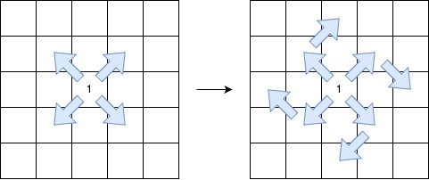

<h3>Length of Longest V-Shaped Diagonal Segment</h3>

You are given a 2D integer matrix <code>grid</code> of size <code>n x m</code>, where each element is either <code>0</code>, <code>1</code>, or <code>2</code>.

A <strong>V-shaped diagonal segment</strong> is defined as:

<ul>
<li>The segment starts with <code>1</code>.</li>
<li>The subsequent elements follow this infinite sequence: <code>2, 0, 2, 0, ...</code>.</li>
<li>The segment:
	<ul>
<li>Starts <strong>along</strong> a diagonal direction (top-left to bottom-right, bottom-right to top-left, top-right to bottom-left, or bottom-left to top-right).</li>
<li>Continues the<strong> sequence</strong> in the same diagonal direction.</li>
<li>Makes<strong> at most one clockwise 90-degree</strong><strong> turn</strong> to another diagonal direction while <strong>maintaining</strong> the sequence.</li>
</ul>
</li>
</ul>

Return the <strong>length</strong> of the <strong>longest</strong> <strong>V-shaped diagonal segment</strong>. If no valid segment <em>exists</em>, return 0.

 

<strong>Example 1:</strong>

<strong>Input:</strong> grid = [[2,2,1,2,2],[2,0,2,2,0],[2,0,1,1,0],[1,0,2,2,2],[2,0,0,2,2]]

<strong>Output:</strong> 5

<strong>Explanation:</strong>

The longest V-shaped diagonal segment has a length of 5 and follows these coordinates: <code>(0,2) → (1,3) → (2,4)</code>, takes a <strong>90-degree clockwise turn</strong> at <code>(2,4)</code>, and continues as <code>(3,3) → (4,2)</code>.

<strong>Example 2:</strong>

<strong>Input:</strong> grid = [[2,2,2,2,2],[2,0,2,2,0],[2,0,1,1,0],[1,0,2,2,2],[2,0,0,2,2]]

<strong>Output:</strong> 4

<strong>Explanation:</strong>

<strong></strong>

The longest V-shaped diagonal segment has a length of 4 and follows these coordinates: <code>(2,3) → (3,2)</code>, takes a <strong>90-degree clockwise turn</strong> at <code>(3,2)</code>, and continues as <code>(2,1) → (1,0)</code>.

<strong>Example 3:</strong>

<strong>Input:</strong> grid = [[1,2,2,2,2],[2,2,2,2,0],[2,0,0,0,0],[0,0,2,2,2],[2,0,0,2,0]]

<strong>Output:</strong> 5

<strong>Explanation:</strong>

<strong></strong>

The longest V-shaped diagonal segment has a length of 5 and follows these coordinates: <code>(0,0) → (1,1) → (2,2) → (3,3) → (4,4)</code>.

<strong>Example 4:</strong>

<strong>Input:</strong> grid = [[1]]

<strong>Output:</strong> 1

<strong>Explanation:</strong>

The longest V-shaped diagonal segment has a length of 1 and follows these coordinates: <code>(0,0)</code>.

 

<strong>Constraints:</strong>

<ul>
<li><code>n == grid.length</code></li>
<li><code>m == grid[i].length</code></li>
<li><code>1 &lt;= n, m &lt;= 500</code></li>
<li><code>grid[i][j]</code> is either <code>0</code>, <code>1</code> or <code>2</code>.</li>
</ul>

